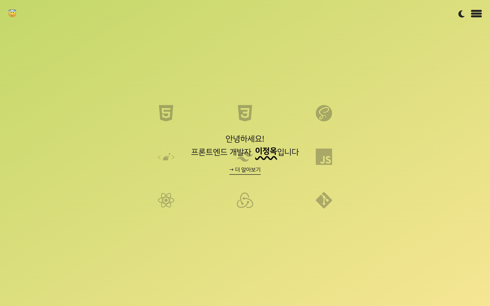
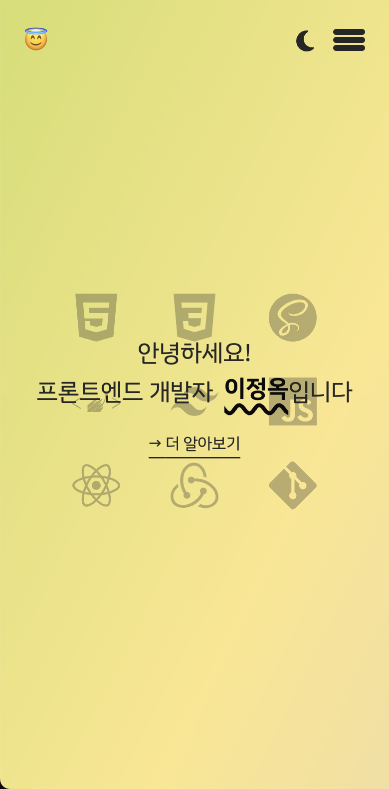
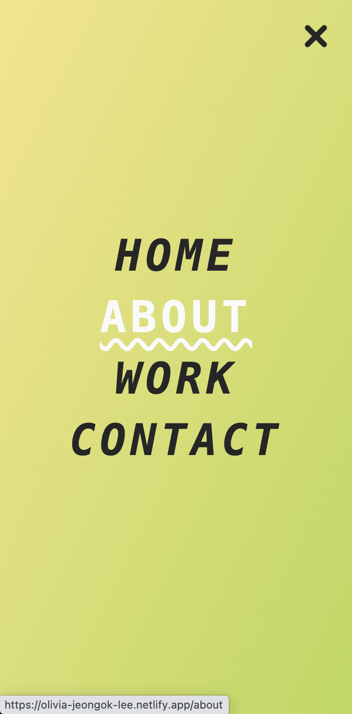
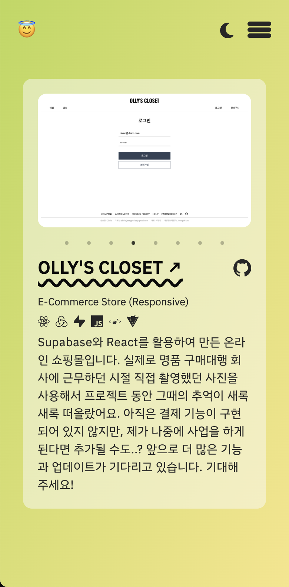

# Welcome to My Portfolio!

<p align='center'>

</p>

## https://olivia-jeongok-lee.netlify.app

<div align="center">


</div>

This is a portfolio website encompassing all of my projects.

## Key Features

- Implemented page navigation using React Router
- Styled with Tailwind CSS, featuring dark mode, and supporting responsive design for different devices
- Integrated email sending functionality using EmailJS

<p align='center'>



</p>

저의 모든 프로젝트를 담은 포트폴리오 웹사이트입니다.

## 주요 기능

- React Router를 사용한 페이지 간의 내비게이션
- Tailwind CSS를 사용한 스타일링과 dark mode, 디바이스에 따른 반응형 디자인 지원
- EmailJS로 메일 발송 기능

## How To Use

To clone and run this application, you'll need [Git](https://git-scm.com) and [Node.js](https://nodejs.org/en/download/) (which comes with [npm](http://npmjs.com)) installed on your computer. From your command line:

```bash
# Clone this repository
$ git clone https://github.com/ok-olly/about-me.git

# Go into the repository
$ cd olly-closet

# Install dependencies
$ npm install

# Run the app
$ npm run dev
```

> olivia.jeongok.lee@gmail.com &nbsp;&middot;&nbsp;
> GitHub [@ok-olly](https://github.com/ok-olly)
